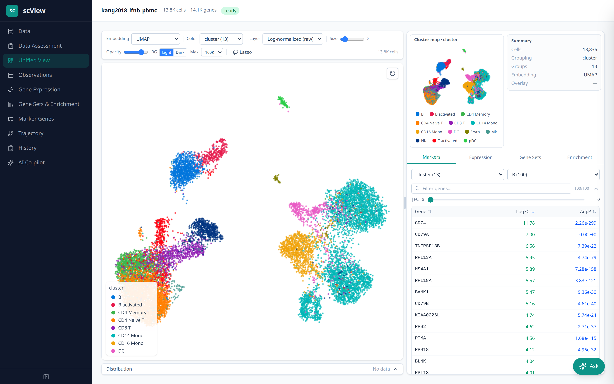
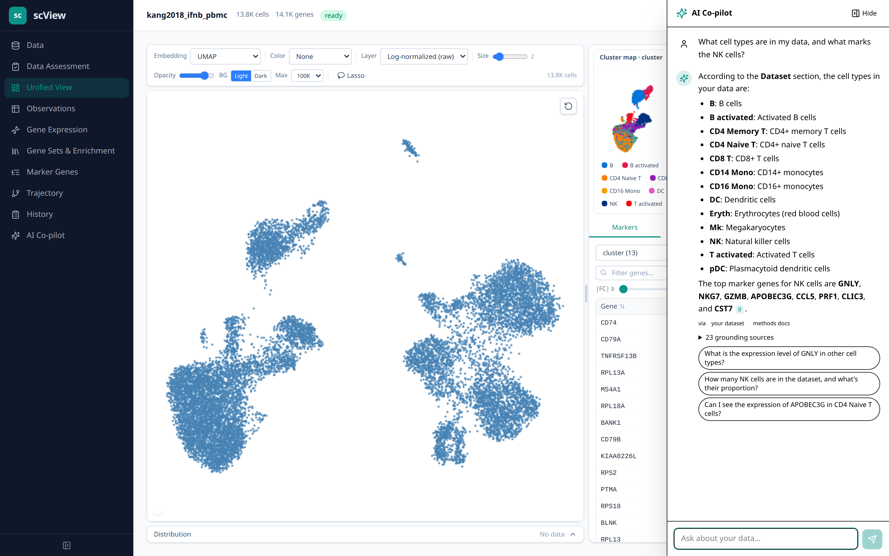
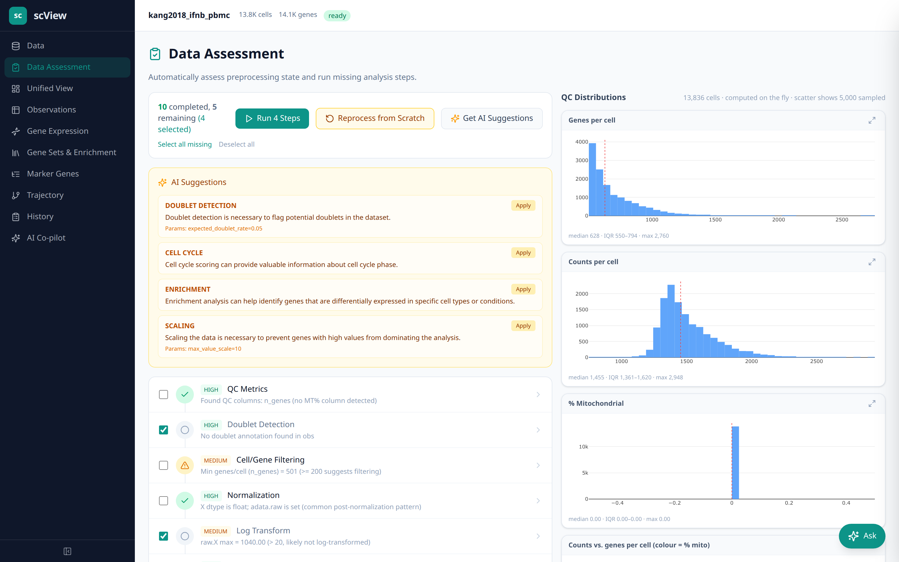
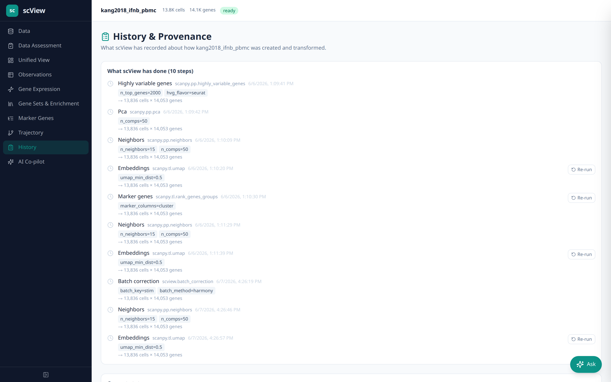
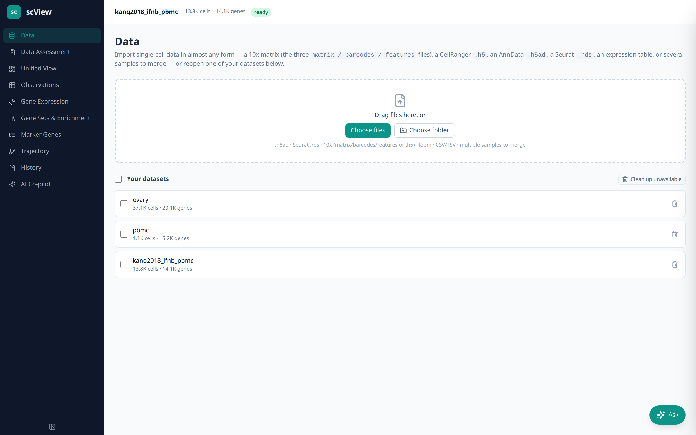

# scView

**A Docker-based, browser-native workspace for single-cell RNA-seq — with an AI co-pilot and built-in provenance.**

scView pairs interactive, linked visualizations (UMAP/t-SNE/PCA, gene expression, clusters,
markers, gene sets, pathway enrichment) with two things most single-cell tools lack: an **AI
assistant that interprets your data and coaches the next analysis step**, and **built-in
provenance** — "git for the h5ad" — so you can always answer *"what was done to this data, and
why?"* Wet-lab and dry-lab users go from a raw matrix to annotated, reproducible figures without
writing code.


*Load a dataset → color by cluster → overlay a gene (with a violin) → ask the AI co-pilot a
grounded, cited question.*

---

## Why scView

Single-cell analysis forces a split: code-first pipelines (Scanpy/Seurat) are powerful but
inaccessible; point-and-click viewers (cellxgene, Loupe) mostly *display precomputed results*.
Neither **interprets** the data for you nor **records** what was done in a way a collaborator or
reviewer can audit. scView closes both gaps:

- 🤖 **AI co-pilot (grounded & cited).** Ask about your data in plain language. Answers are grounded
  in your dataset's results + provenance **and** a scRNA-seq methods/literature corpus, with
  clickable citations (PubMed + jump-to-cluster). A cheap intent classifier routes each question so
  it only spends what it needs, and it's available even before a dataset is loaded.
- 🧭 **AI-assisted assessment.** A deterministic assessor reports the state of ~15 preprocessing
  steps; an LLM advisor recommends the next steps with reasons and sized parameters — *you* always
  approve before anything runs.
- 🧬 **Provenance — "git for the h5ad".** Every step is recorded into the data as a commit-style,
  replayable recipe with dependency-aware *edit & re-run from here*. Originals stay immutable.
- 📦 **Forgiving multi-format ingestion.** h5ad, 10x MEX/HDF5, loom, zarr, dense CSV, Seurat `.rds`,
  and nf-core/scrnaseq outputs — via a guided "Add Data" flow.
- 🖥️ **Unified, linked, server-backed exploration.** A Kana-style single screen: scatter + tabbed
  Markers/Expression/Gene Sets/Enrichment + violin, scaling to ~200k cells via a FastAPI backend,
  Apache Arrow, and deck.gl.

> Trust by design: the *facts* about your data are computed deterministically and reproducibly; the
> *LLM only advises*, and every action it suggests is approved by you and recorded in provenance.

---

## Screenshots

### Unified View

*One linked screen: a UMAP colored by cell type, a camera-linked cluster reference map, a summary
card, and a sortable markers table — recoloring, violins, and cluster highlighting all linked.*

### AI co-pilot

*Ask about your data and get a grounded, cited answer — here the cell types and NK-cell markers,
with a "via" route badge, expandable grounding sources, and suggested follow-ups. Citation chips
link to PubMed or jump to the cluster in the app.*

### AI-assisted Data Assessment

*QC distribution plots plus a preprocessing step list. "Get AI Suggestions" returns recommended
next steps with reasoning and parameters — one click to apply, you decide whether to run.*

### History / provenance

*Every recorded step as a timeline ("git for the h5ad"), with dependency-aware edit-&-re-run and an
exportable, replayable recipe.*

### Forgiving data import

*Drop almost any format — 10x matrix/HDF5, h5ad, loom, CSV, Seurat `.rds`, nf-core outputs — and
reopen or manage previously loaded datasets.*

---

## Quick start

Requires Docker + Docker Compose.

```bash
git clone https://github.com/thirtysix/scView.git
cd scView

# production stack (frontend on :3000, backend on :8080, R converter on :8001)
make up
# → open http://localhost:3000

# …or the dev stack with hot-reload (frontend on :5173)
make dev
# → open http://localhost:5173
```

**Optional — enable the AI features.** Copy `.env.example` to `.env` and set a
[DeepInfra](https://deepinfra.com/dash/api_keys) API key:

```bash
DEEPINFRA_API_KEY=your-key-here
```

Without a key, the assistant degrades gracefully to deterministic, rule-based guidance. The RAG
co-pilot's literature/tutorials corpora additionally require a Postgres/pgvector connection string
(`RAG_DATABASE_URL`) — see `docs/AI_ASSISTANT.md`.

---

## Architecture

Three Docker services:

- **backend** — FastAPI (`backend/src/scview`): AnnData I/O with lazy loading + LRU cache, an
  on-demand analysis pipeline (scanpy / harmonypy / gseapy / Scrublet), the AI assessor + advisor +
  RAG co-pilot, and Apache Arrow IPC serialization.
- **frontend** — React 18 + Vite + TypeScript + deck.gl, with Web Workers for Arrow decoding.
- **converter** — an R service (sceasy) that converts Seurat `.rds` → h5ad.

More detail: [`docs/ARCHITECTURE.md`](docs/ARCHITECTURE.md) ·
AI assistant design: [`docs/AI_ASSISTANT.md`](docs/AI_ASSISTANT.md).

## Development

```bash
make test          # backend test suite (pytest)
ruff check backend/src
( cd frontend && npm run build )   # strict type-check + production build
```

## Status

Active development (Phase 6: polish & testing). The AI co-pilot, dual-corpus RAG, provenance, and
multi-format ingestion are implemented; see [`docs/AI_ASSISTANT.md`](docs/AI_ASSISTANT.md) and
[`docs/FUTURE.md`](docs/FUTURE.md) for the roadmap.

## License

_TODO — add a license before public release._
